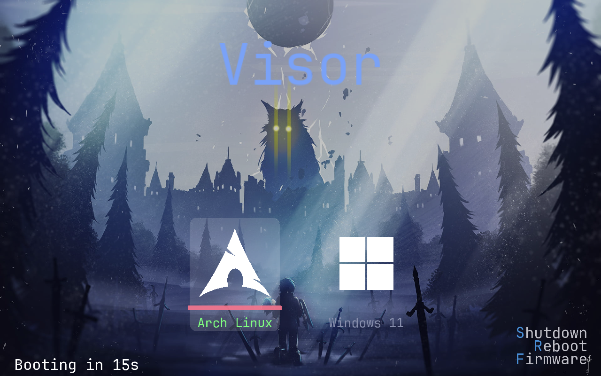
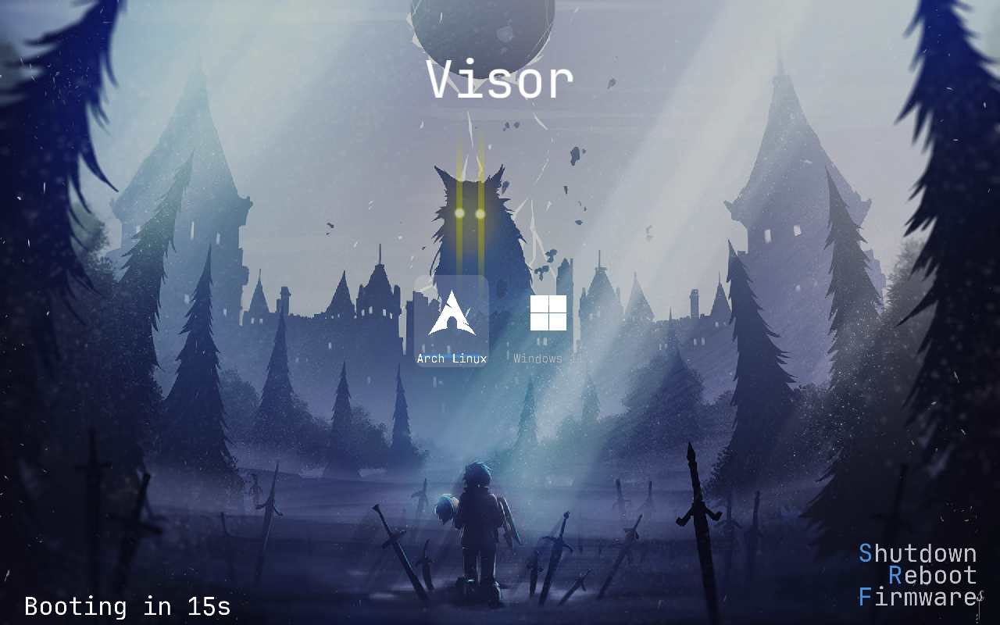

# Visor 

A minimal, fast, modern, graphical UEFI boot manager. 

Visor draws an icon-based boot menu which combines the efficiency and speed of grub with the beauty of refind, capable of booting **Linux** (EFI stub kernels / Unified Kernel Images) or chainloading other efi executables (including Windows Boot Manager)  no external dependencies, no scripting bs — just a config and ur imagination.

# Visor Menu

<p align="center">
  
  
</p> 

## Features

- **Graphical, double-buffered menu** — flicker-free rendering via the UEFI
  Graphics Output Protocol (GOP).
- **Fluid Animations** — smooth animations for switching between entries.  
- **Customizable UI** — almost everything you see can be customized.
- **Auto-detection** — if `boot.conf` is missing, Visor scans for common Linux
  and Windows loaders and builds a menu automatically.
- **Mouse & touch** — pointer cursor with single-click-to-boot, when the firmware
  exposes a pointer device.
- **Secure Boot aware** — verifies images through shim's `SHIM_LOCK` protocol when
  present, and refuses an unverifiable kernel under Secure Boot.
- **Self-pruning logs** — `boot.log` keeps only the last 3 boots, with
  descriptive messages at every fallible step for easy debugging.

---

## Requirements

- An **x86_64 UEFI** system
- **gnu-efi** development files.
- **GCC** and **binutils** (`objcopy`).
- *(Optional)* **Python 3 + Pillow** — only to re-bake a different font; the
  default font is committed, so normal builds need neither.

### Install dependencies

| Distro            | Command                                            |
|-------------------|----------------------------------------------------|
| Arch              | `sudo pacman -S gnu-efi base-devel`                |
| Debian / Ubuntu   | `sudo apt install gnu-efi build-essential`         |
| Fedora            | `sudo dnf install gnu-efi gnu-efi-devel gcc make`  |
| openSUSE          | `sudo zypper in gnu-efi-devel gcc make`            |
| Void              | `sudo xbps-install gnu-efi-libs gcc make`               |

---

### Quick Install

Installs the build tools for your distro, downloads Visor, builds it, and
installs it — all in one go:

```sh
sh -c "$(curl -fsSL https://raw.githubusercontent.com/IO-ZetZor/Visor-BootManager/main/get.sh)"
```

(or with `wget`)
```sh
sh -c "$(wget -qO- https://raw.githubusercontent.com/IO-ZetZor/Visor-BootManager/main/get.sh)"
```

## Building

```bash
make
```

This produces `visor_x64.efi` in the project root. The Makefile auto-detects
the gnu-efi headers and `crt0-efi-x86_64.o` across distros; if yours installs
them somewhere unusual, override the paths:

```bash
make GNU_EFI_INC=/path/to/efi CRT0=/path/to/crt0-efi-x86_64.o
```

If gnu-efi is missing, `make` stops early with an explanatory message instead
of a cryptic compiler error.

---

### Manual install 

```bash
git clone https://github.com/IO-ZetZor/Visor-BootManager.git
cd Visor-BootManager
sudo ./install.sh
```
*Options:**

| Flag               | Effect                                                        |
|--------------------|---------------------------------------------------------------|
| `--esp <path>`     | Use this ESP mount point instead of auto-detecting.           |
| `--no-build`       | Install the already-built `visor_x64.efi`.                    |
| `--boot-entry`     | Register a `Visor` UEFI boot entry via `efibootmgr`.          |
| `--no-boot-entry`  | Do not ask about creating a UEFI boot entry.                  |
| `--sign`           | Sign Visor with `sbctl` after installing.                     |
| `--no-sign`        | Do not ask about Secure Boot signing.                         |
| `--fs-driver <path>` | Install an EFI filesystem driver into `\EFI\visor\drivers\`. |
| `--no-cli`         | Do not install the host-side `visor` command.                 |
| `--cli-dir <path>` | Install the host-side command somewhere other than `/usr/local/bin`. |
| `--force-config`   | Overwrite an existing `boot.conf` with the bundled example.   |
```
After installing, **edit `<ESP>/EFI/visor/boot.conf`** to point at your real
kernels and set your root partition.

```

### Visor CLI

The installer also adds a host-side `visor` command:

```bash
visor build
visor install --esp /boot/efi
visor update
visor sign --esp /boot/efi
visor status
visor config validate --esp /boot/efi
visor uninstall --esp /boot/efi
visor clean
```

`visor install` passes its arguments through to `install.sh`. `visor sign`
signs the installed EFI binary. `visor status` reports the current install
state. `visor config validate` checks the syntax of a config file.

### Updating

After installation, update to the latest committed version from GitHub with:

```bash
visor update
```

The updater clones `https://github.com/IO-ZetZor/Visor-BootManager` into a local
source checkout on first run, then uses `git pull` on later runs. It rebuilds
Visor and runs `install.sh --no-build` without replacing your existing
`boot.conf`. Use `visor update --esp /your/esp/mount` if ESP auto-detection is
wrong, and `visor update --sign` if you want the updated binary signed with
`sbctl`.

```
### Manual installation to ESP

```bash
# 1. Mount the ESP (skip if already mounted at /boot/efi).
sudo mount /dev/sdXn /mnt/esp

# 2. Copy the binary and assets.
sudo mkdir -p /mnt/esp/EFI/visor/icons /mnt/esp/EFI/visor/backgrounds
sudo cp visor_x64.efi              /mnt/esp/EFI/visor/
sudo cp assets/icons/*.png         /mnt/esp/EFI/visor/icons/
sudo cp assets/backgrounds/*.png   /mnt/esp/EFI/visor/backgrounds/
sudo cp boot.conf.example          /mnt/esp/EFI/visor/boot.conf

# 3. Register a boot entry (disk = whole disk, part = ESP partition number).
sudo efibootmgr --create --disk /dev/sdX --part n \
                --label "Visor" --loader '\EFI\visor\visor_x64.efi'
```

---

## Configuration

Config lives at `\EFI\visor\boot.conf` on the ESP. A fully-commented reference
is in [`boot.conf.example`](boot.conf.example).

**Path rules:** all paths are relative to the **root of the ESP** and use
back-slashes, e.g. `\EFI\visor\icons\arch.png`. Colors are `#RRGGBB`.

### Global settings

| Key               | Values / meaning                                                                                           |
|-------------------|------------------------------------------------------------------------------------------------------------|
| `timeout`         | `N` = auto-boot the default after N seconds · `-1` = wait forever · `0` = boot default instantly (no menu) |
| `default`         | Index of the default entry (0-based).                                                                      |
| `show_names`      | `1` = show entry names under icons · `0` = icons only.                                                     |
| `text_menu`       | `1` = use text-mode instead of a graphical menu. Fallback menu if firmware denies rendering                |
| `resolution`      | Resolution at which the menu is rendered. `native` = default. `max` = highest resolution firmware offers. `WxH` = custom resolution, eg `resolution=1920x1080`. |
| `quiet`           | `1` = black screen during hand-off · `0` = show progress text.                                             |
| `center_info`     | `1` = show selected entry details near the bottom. Path-only when `show_names=1`                           |
| `entries_per_page`| Entries shown per page. Default `3`.                                                                       |
| `title`           | Menu title. Empty/absent = `Visor` · `none` = no title · else verbatim.                                    |
| `font`            | Text font. Currently `jetbrains`. Empty = default.                                                         |
| `theme`           | Load `themes/<name>.conf`; its UI values override those in `boot.conf`. `random` = pick a random theme each boot · `cycle` = advance to the next theme each boot (saved in NVRAM). See [Themes](#themes). |
| `remember_last`   | `1` = remember the last-booted entry and preselect it next time (NVRAM); **overrides** `default=`. `0` = always use `default=`. |
| `recovery_entries`| `1` = auto-add a `<name> (recovery)` entry per Linux entry, appending `systemd.unit=rescue.target nomodeset`. |
| `mouse`           | `1` = mouse/touchpad/touchscreen cursor; **single click** boots an entry or runs a power icon · `0` = off. |
| `editor`          | `1` = allow editing a kernel command line at the menu with `e` (one-shot) · `0` = disable.                 |
| `title_color`     | Title text color, `#RRGGBB`.                                                                               |
| `name_color`      | Default entry-name color, `#RRGGBB`.                                                                       |
| `box_radius`      | Corner radius (in pixels) of the selection highlight / frost box. 0 = Default                              |
| `highlight_color` | Selection accent/underline color, `#RRGGBB`.                                                               |
| `blur`            | Blurred-glass highlight that follows the selection (entries **and** power actions), replacing the flat card. `0`/absent = flat card · `1` = frosted (blur + tint) · `clear` = clear blur (no tint). |
| `blur_title`      | `1` = static blurred panel behind the title. Independent of `blur`.                                       |
| `blur_color`      | Tint colour for frosted mode, `#RRGGBB`. Absent = white. Ignored when `blur=clear`.                       |
| `anim_speed`      | Selection animation speed, `1` (slow) .. `10` (fast). Default `8`. Entry↔power cross-fades; within a row/column slides. |
| `title_size`      | Title height in pixels. `0`/absent = `screen_height / 12`.                                                 |
| `name_size`       | Entry-name height in pixels. `0`/absent = `16`.                                                            |
| `icon_size`       | Icon edge length in pixels (square). `0`/absent = `64`.                                                    |
| `icon_spacing`    | Horizontal gap between icons in pixels. `0`/absent = `60`.                                                 |
| `icon_y`          | Vertical center of the icon row in pixels. `0`/absent = screen middle.                                     |
| `underline_color` | Selection underline color, `#RRGGBB`. Absent = `highlight_color`.                                          |
| `underline_thickness` | Underline height in pixels. `0`/absent = `4`.                                                          |
| `underline_length`| Underline width in pixels. `0`/absent = icon width + margin.                                               |
| `power_position`  | Corner for the power actions: `bottomright` (default), `bottomleft`, `topright`, `topleft`.                |
| `shutdown_color`  | Color of the **S**hutdown hotkey letter, `#RRGGBB`. Absent = `highlight_color`.                            |
| `reboot_color`    | Color of the **R**eboot hotkey letter, `#RRGGBB`. Absent = `highlight_color`.                              |
| `firmware_color`  | Color of the **F**irmware hotkey letter, `#RRGGBB`. Absent = `highlight_color`.                            |
| `power_icons`     | `1` = draw the power actions as icons instead of text (still triggered by S/R/F). Needs the `*_icon` keys.  |
| `power_icon_size` | Power-icon edge length in pixels. `0`/absent = `40`.                                                       |
| `shutdown_icon`   | PNG for the Shutdown action (used when `power_icons=1`). Falls back to text if missing.                     |
| `reboot_icon`     | PNG for the Reboot action (used when `power_icons=1`). Falls back to text if missing.                       |
| `firmware_icon`   | PNG for the Firmware action (used when `power_icons=1`). Falls back to text if missing.                     |
| `background`      | Full-screen background image (PNG, RGB or RGBA). Falls back to `backgrounds/default.png` if missing/corrupt.|

### Boot entries (Examples)

Visor auto-detects how to boot each one from the image
itself: a PE image with no initrd/cmdline is chainloaded (e.g. Windows
`bootmgfw.efi`, loaded by device path so its BCD is found); a PE UKI or EFI-stub
kernel is started with its cmdline/initrd applied if given; a raw (non-PE) kernel
uses the Linux EFI handover path. (The old `linux`/`windows` block names still
parse as aliases for `entry`, so existing configs keep working.)

```conf
entry {
    name    = "Arch Linux"      # shown under the icon
    icon    = \EFI\visor\icons\arch.png
    color   = #1793D1           # optional: overrides name_color for this entry
    kernel  = \vmlinuz-linux    # EFI stub kernel or UKI .efi
    initrd  = \initramfs-linux.img        # optional (omit for a UKI)
    cmdline = "root=PARTUUID=... rw quiet" # optional (omit for a UKI)
}

entry {
    name   = "Windows 11"
    icon   = \EFI\visor\icons\windows.png
    kernel = \EFI\Microsoft\Boot\bootmgfw.efi
}
```

| Entry key | Meaning                                                             |
|-----------|---------------------------------------------------------------------|
| `name`      | Display name under the icon.                                      |
| `icon`      | PNG icon (square, e.g. 128×128, RGBA recommended).                |
| `icon_size` | Per-entry icon edge length in pixels; overrides global `icon_size`|
| `kernel`  | EFI stub kernel / UKI (`linux`) or `bootmgfw.efi` (`windows`).      |
| `initrd`  | initrd image — Linux only, optional (omit for a UKI).               |
| `cmdline` | Kernel command line — Linux only, optional (omit for a UKI).        |
| `color`   | Per-entry name color, `#RRGGBB` (overrides `name_color`).           |
| `uuid`    | Partition UUID hint for Windows chainloading, optional.             |
| `sha256`  | Pin the image's SHA-256 (64 hex). Boot is refused on mismatch.      |

### Changing the font size

Set `title_size` and `name_size` (pixels) in the global section. For example:

```conf
title_size=120
name_size=28
```

Leave them out (or `0`) for the defaults (`screen_height/12` and `16`).

### Using a different font

The font is baked into the binary from a TTF, so a normal build needs no font
tooling. To swap it, regenerate the atlas (needs Python 3 + Pillow) and rebuild:

```bash
make bakefont FONT=/usr/share/fonts/TTF/YourFont.ttf FONT_PX=64
make
```

### Themes

Instead of scattering UI tweaks through `boot.conf`, you can keep a whole look in
a theme file and switch with a single line.

1. Create `\EFI\visor\themes\<name>.conf` on the ESP (a `themes/` folder is made
   for you at install time, with a sample `nord.conf`).
2. Put any UI keys in it — the same keys used in `boot.conf` (colors, sizes,
   `icon_*`, `underline_*`, `power_position`, `background`, `title`, …).
3. In `boot.conf`, set `theme=<name>`.

When a theme is set, its values **override** whatever `boot.conf` specifies for
those keys. Keys the theme doesn't mention keep their `boot.conf`/default value.
Boot entries (`linux {}` / `windows {}`) always live in `boot.conf` — themes are
UI-only.

```conf
# boot.conf
theme=zero
```

```conf
# themes/zero.conf  (overrides boot.conf's UI)
title=Visor
title_color=#88C0D0
name_color=#ECEFF4
underline_color=#A3BE8C
underline_thickness=8
icon_size=128
power_position=bottomright
shutdown_color=#BF616A
reboot_color=#EBCB8B
firmware_color=#A3BE8C
background=\EFI\visor\backgrounds\default.png
```

---

## Controls

| Key            | Action                                                               |
|----------------|----------------------------------------------------------------------|
| `Left`/`Right` | Move between boot entries (wraps)                                    |
| `Down`         | Enter the power column (Shutdown), then move down it                 |
| `Up`           | Move up the power column; from the top, return to the boot entries   |
| `Enter`        | Boot the focused entry, or run the focused power action              |
| `e`            | Edit the focused entry's kernel command line, then boot it (one-shot) |
| `1`–`9`        | Boot entry N directly                                                |
| `Esc`          | Boot the default entry                                               |
| `S`            | Shut down (works from anywhere)                                      |
| `R`            | Reboot (works from anywhere)                                         |
| `F`            | Enter firmware setup (works from anywhere)                           |
| Mouse / touch  | Move to show a cursor; **single click** an icon to boot it, or a power icon to run it |


---

## Linux EFI stub requirements

To boot via the EFI stub, the kernel must be built with:

```
CONFIG_EFI=y
CONFIG_EFI_STUB=y
```

Most distributions enable these by default. Unified Kernel Images (e.g. from
`systemd-ukify` or `dracut --uefi`) already bundle the stub, initrd, and
cmdline — point `kernel` at the `.efi` and omit `initrd`/`cmdline`.

**Recommended: Unified Kernel Images (no driver).** A UKI on the FAT ESP at
`\EFI\Linux\*.efi` bundles the kernel, initrd and cmdline into one EFI binary
and boots with zero extra code. This is the simplest and most portable setup —
prefer it unless you specifically want raw `vmlinuz`+`initrd` off a Linux
filesystem.

**Optional: bring-your-own filesystem driver.** Visor **ships no filesystem
drivers** Instead it loads whatever EFI driver *you* place in **`\EFI\visor\drivers\`** — every `*.efi`
there is started at boot and connected to your disks.

Obtain a driver yourself — the open-source `efifs` set provides `btrfs_x64.efi`, `ext4_x64.efi`, etc.:

```sh
mkdir -p <ESP>/EFI/visor/drivers
cp <your>/btrfs_x64.efi <ESP>/EFI/visor/drivers/
```

`boot.log` reports `drivers: started N, connecting controllers` when this works.
If Secure Boot is on, the driver must be signed/enrolled (e.g. via `sbctl`) too.

---

## Secure Boot

Visor is Secure Boot aware. Before launching any image it asks shim's `SHIM_LOCK`
protocol to verify it (the same trust path used when Visor is itself started by
`shimx64.efi`):

- **PE images** (Windows Boot Manager, UKIs, EFI-stub kernels) — if shim is present
  and verification fails, the boot is refused. If shim is absent, the firmware's own
  image verification (via `LoadImage`) still applies under Secure Boot.
- **Raw (non-PE) kernels** booted through the EFI handover protocol bypass firmware
  verification entirely, so under Secure Boot Visor refuses them unless shim verifies
  them first.

With Secure Boot **off**, everything boots as before. For a fully signed chain, sign
`visor_x64.efi` (and any efifs driver) and enrol the keys with `sbctl`, or boot Visor
via shim so shim validates your kernels against the enrolled db/MOK.

---

## Troubleshooting

Visor writes a log to **`\EFI\visor\boot.log`** on the ESP. It is overwritten
each boot but retains the **last 3 boots**, and logs every fallible step
(config parse, PNG decode, image load, hand-off). Read it first when something
fails — most problems are one descriptive line away.

---

MASSIVELY INSPIRED BY rEFInd!!

